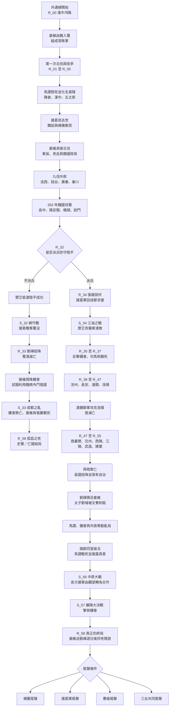
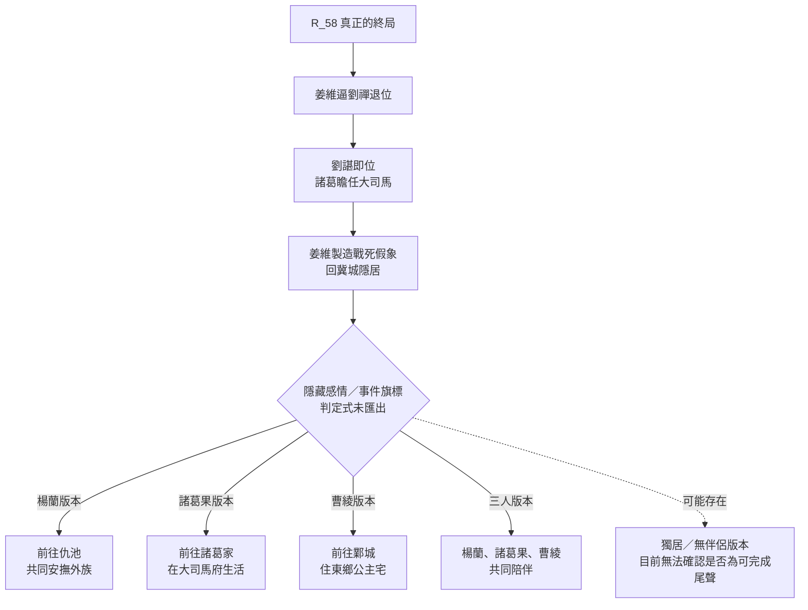

# 《姜維傳》劇情路線與分支分析

> 本文件直接依據 `ExtractedScripts/` 下的 117 份文字匯出檔整理：`R_00.txt` 至 `R_58.txt` 共 59 份章間劇情，`S_00.txt` 至 `S_57.txt` 共 58 份戰場腳本。

## 一、先說結論

這套劇本不是從頭到尾都有大量平行路線的多線制遊戲，而是：

1. `R_00` 至 `R_32` 大致為共通主線。玩家一路經歷姜維投蜀、諸葛亮北伐、街亭與五丈原、諸葛亮死後的蜀漢政局、姜維歷次北伐，以及魏國伐蜀。
2. 共通線中幾乎每章都有戰術二選一，但多數只改變該戰役配置、增援、角色事件、單挑、印綬或隱藏傾向，最後仍回到同一章節鏈。
3. 真正改變整個故事世界線的核心分支只有一個：`R_32` 是否派兵防守陰平。
4. 不防守陰平會進入接近史實的亡國線：鄧艾破綿竹、劉禪降魏、姜維假降鍾會但復國失敗，最後在 `R_58` 的「孤臣之死」收束。
5. 防守陰平會進入大規模架空線：阻止鄧艾、擊潰鍾會、司馬昭戰死，繼而滅晉、伐吳，再經歷劉禪猜忌、馬謖與鍾會策動的終末動亂，最後到 `R_58` 的「真正的終局」。
6. 真結局之後另有楊蘭、諸葛果、曹綾、三女共同陪伴等尾聲版本；文本能證實版本存在，但匯出檔沒有保留好感旗標與門檻，無法僅靠目前資料精確寫出攻略條件。

## 二、資料格式與分析限制

每份檔案都是 EEX 文字匯出，例如：

```text
R_32 EEX text export
Encoding: Big5 (CP950). Brackets contain the original EEX offset.
[0009CD] 派遣軍隊去防守：不派遣軍隊防守
```

- 方括號中的數字是原 EEX 位元偏移，不是可直接追蹤的劇情標籤。
- 選項通常以全形冒號分隔；三選一有時會混用空格。
- 匯出檔保留了台詞、選項、戰鬥條件與部分事件名稱，沒有保留 `goto`、條件式、變數 ID、好感值或章節進入表。
- 同一檔內連續出現兩段選項後文字，不代表遊戲會把兩段都播放；它們通常是被控制碼分隔的互斥分支。
- 同一段事件重複出現，通常表示不同旗標或角色狀態下的版本，不能單憑文字順序當成連續事件。

以下採用三種可信度：

| 標記 | 意義 |
|---|---|
| **確定** | 選項、結果或章名在文本中明寫，前後劇情能相互印證 |
| **高度可信** | 沒有跳轉 opcode，但相鄰章節的劇情與戰場內容只有一種合理接法 |
| **推定** | 能看出存在條件版本，但缺少旗標與判定式，無法確認門檻 |

## 三、主劇情流程圖



> `R_32 → S_32` 與 `R_32 → R_34/S_34` 的原始跳轉碼不在匯出檔中，但兩邊的因果敘述完整對應，因此列為**高度可信**。`S_33 → R_58「孤臣之死」` 與 `S_57 → R_58「真正的終局」` 同理。

## 四、共通線分段整理

### 1. 姜維入蜀與諸葛亮時代（`R_00` 至 `R_12`）

- 姜維原在魏國天水陣營，經諸葛亮第一次北伐後轉投蜀漢，逐漸組成自己的核心部隊「常敗軍」。
- 劇情經過羌軍、街亭、陳倉、漢中、張郃與五丈原等事件。
- 街亭失敗後，姜維保下馬謖；馬謖改名「甯隨」，從公開歷史中消失，轉為姜維身邊的影子參謀。這個伏筆一直延續到終局。
- 諸葛亮死後，魏延與楊儀衝突爆發；姜維開始從被提拔的後進，轉變成承接北伐與蜀漢存亡責任的人。

### 2. 諸葛亮死後的成長期（`R_13` 至 `R_19`）

- 姜維出使東吳，處理陰平、漢嘉、興勢、汶山、隴西與麴城等戰事。
- 楊蘭與諸葛果逐漸成為主角身邊最重要的女性角色；曹綾則從魏國政治線逐步與姜維的命運交會。
- 多個選項開始明顯帶有「戰術人格」與「感情傾向」色彩，但沒有在此形成獨立大路線。

### 3. 姜維北伐與魏國內亂（`R_20` 至 `R_28`）

- 劇情涵蓋鐵籠山、襄武、毌丘儉、洮西、段谷、壽春、秦川與侯和等戰事。
- 姜維與鄧艾逐漸成為彼此最重要的宿敵；兩人不只比用兵，也分別思考制度、階級與亂世的根源。
- 蜀漢內部的益州、荊州與外來者矛盾持續累積，讓「國家不是被單一強敵打敗，而可能被內部分裂拖垮」成為核心主題。

### 4. 魏國伐蜀與命運斷點（`R_29` 至 `R_32`）

- 魏軍大舉伐蜀，先後經過沓中、陽安關、橋頭與劍門。
- 姜維成功守住劍門正面，但張嶷與諸葛果發現鄧艾不在主戰場，推斷他可能從陰平小路繞後。
- `R_32:34` 出現全劇最重要選項：`派遣軍隊去防守：不派遣軍隊防守`。

## 五、核心分支 A：不防守陰平

**路線性質：確定為亡國線；章節接法高度可信。**

1. 姜維認為陰平小路幾乎不可能通行，不願因不確定情報分散兵力（`R_32:39-48`）。
2. 鄧艾翻越陰平、奪取江油，諸葛瞻不採黃崇據險迎擊的意見，最後退至綿竹（`R_32` 後半）。
3. `S_32` 的綿竹戰以諸葛瞻一方迎戰鄧艾；即使玩家在戰場上操作，敘事結果仍是諸葛瞻父子、黃崇、李球、張遵等人戰死。
4. `R_33` 中成都無兵可守，譙周力主投降；劉禪交出印信，蜀漢於 263 年滅亡（`R_33:4-71`）。
5. 姜維收到就地投降的詔令後，決定假意投降鍾會，利用鍾會、鄧艾、司馬昭之間的嫌隙復國（`R_33:214-300`）。
6. 復國計畫最終失敗。`S_33` 是成都鍾會之亂，勝利條件顯示為 `？？？`，並直接寫出「姜維被成都的亂軍所殺」（`S_33:14,119`），屬劇情性必敗戰。
7. `R_58:5` 起的「孤臣之死」描寫姜維拒降、力戰而死；楊蘭為掩護同伴，自稱姜維正妻後犧牲。
8. 倖存者四散：部分降晉，部分保存南中勢力，甯隨轉而扶持孫皓，句扶尋求外族力量。魏隨後被司馬氏篡奪，故事停在晉、吳仍將交戰的歷史方向。

### 亡國線的主題

- 姜維雖敗，仍以犧牲名譽的方式尋找最後一線復國可能，因此「成敗不足以論英雄」是收束重點。
- 真正使蜀漢覆亡的不是單一武將，而是中央判斷、將相猜忌、派系衝突與地方離心共同作用。
- `R_58:564-569` 明確總結復國失敗、蜀魏相繼滅亡，並把後續歷史交給司馬炎與孫皓。

## 六、核心分支 B：防守陰平

**路線性質：確定為架空延伸線；章節接法高度可信。**

### 1. 阻止鄧艾，逆轉伐蜀戰（`R_34` 至 `R_37`）

- 姜維派張嶷率無當飛軍伏擊陰平，諸葛果回成都組織援軍。
- 諸葛果說服諸葛瞻，張星彩親自出戰，成都方面在江油集結大軍（`R_34:79-228`）。
- `S_34` 中鄧艾軍翻山後飢疲交迫，又遭前後夾擊；鄧忠斷後戰死，鄧艾逃回北方。
- `R_35` 明寫「諸葛瞻軍徹底擊潰鄧艾軍」（`R_35:6-10`）。鍾會因糧盡撤退，姜維展開追擊。
- 漢軍擊潰鍾會主力；司馬昭再次投入兵力後，在子午谷戰死（`R_37:59-61`），魏國侵蜀攻勢瓦解。

### 2. 蜀漢北伐與滅晉（`R_38` 至 `R_47`）

- 蜀軍由防守轉為反攻，戰線經過涼州、祁山、長安與潼關。
- 曹氏勢力與蜀漢因共同對抗司馬氏而形成漢魏聯軍。
- 聯軍攻克洛陽，司馬炎自盡，晉朝在建立未滿一年時滅亡（`R_47:4-6,49-52`）。
- 鄧艾在敗亡前與姜維討論中央集權、英雄政治與皇帝猜忌，並警告姜維真正的危險來自背後的劉禪（`R_47:21-40`）。
- 漢、魏並未簡單合併；魏國保有幽冀等地與高度自治，形成名義臣屬、實際近似兄弟邦的安排。

### 3. 救襄樊與伐吳（`R_47` 至 `R_55`）

- 晉亡後，東吳趁機進攻襄樊。姜維選擇救援舊晉軍，因而取得司馬家與晉臣的信任（`R_47:455-521`、`R_48:4-42`）。
- 此後戰線依序推進交州、西陵、壽春、江陵、武昌、濡須口與建業。
- 陸抗敗亡，孫皓在建業戰敗後焚城；吳國投降，但姜維仍主張由吳人自治，不把戰敗者全部剝奪（`R_55:4-58`）。
- 這段不是旁支，而是終局援軍成立的前因：姜維曾救司馬家、禮遇魏人、救援建業並承諾吳國自治，所以最後各方才願意冒險援救他。`R_58:601-603` 也直接回顧這一點。

### 4. 劉禪猜忌與馬謖計畫（`R_55` 至 `R_56`）

- 天下接近統一後，姜維的軍事威望反而成為劉禪的威脅。
- 文鴦刺殺太子劉璿，劉禪認定姜維涉案，徵召姜維回洛陽並暗藏殺機（`R_55:159-266,295-373`）。
- 馬謖表面投向劉禪，煽動朝廷討伐姜維；鍾會則串聯故晉勢力與外族。姜維在譙郡被迫與漢軍同室操戈。
- 馬謖戰敗死亡後留下書信，揭露他的真正目的：故意製造一個足以迫使各方合作的共同敵人，摧毀舊有安樂與皇權結構，逼姜維完成他一直不敢主動發動的制度革命（`R_56:60-117`）。
- 這個計畫並非純粹正義。文本反覆強調馬謖主動造成巨大死傷，且鍾會的失控程度超出預期。

### 5. 中原與雒陽終戰（`R_56`、`S_56`、`R_57`、`S_57`）

- 姜維起初只有約五千人，面對十萬以上叛軍與外族聯軍（`R_56:465-478`）。
- 原本觀望的蜀漢各派、魏國、司馬家、荊州與吳國軍隊，因過往恩義和共同避免天下再亂的利益陸續參戰。
- `S_57` 的主要目標是擊倒鍾會；戰役中可救出北地王劉諶，失敗條件會由未知條件切換為 60 回合版本（`S_57:87-90,125-158`）。
- 戰中另有「殺了蔣舒／放了蔣舒」等局部分支，影響人物尾聲，但不再改變主結局方向。

### 6. 真正的終局（`R_58:570` 起）

- 鍾會的野心破滅後被處決，姜維不把他視為最終問題；真正的威脅是把天下安危綁在單一皇帝或英雄身上的制度。
- 姜維以劉禪親署的外族徵召詔書逼其退位，但自己不篡位，反而安排「被叛軍殘兵殺死」的假消息後退出政治（`R_58:610-646`）。
- 北地王劉諶即位，諸葛瞻任大司馬；魏、吳由從屬國轉向兄弟邦，中央將權力交給多方協作（`R_58:665-686`）。
- 新制度的核心不是再找一位完美英雄，而是讓平凡人共同承擔決策與責任（`R_58:687-706`）。
- 姜維回冀城陪母親走完最後一年，再依隱藏條件進入不同陪伴尾聲。

## 七、真結局尾聲流程圖



### 尾聲版本的文本證據

| 版本 | `R_58` 範圍 | 結果 |
|---|---:|---|
| 楊蘭 | `1175-1207`、`1308-1334`、`1391-1420` | 姜維前往仇池，與楊蘭共同維持外族同盟 |
| 諸葛果 | `1208-1242`、`1335-1364`、`1420-1445` | 姜維進入諸葛家，在大司馬府度過餘生 |
| 曹綾 | `1243-1275`、`1365-1390`、`1446-1473` | 姜維隨曹綾前往鄴城，遠離魏國影子政治 |
| 三女共同 | `1276-1307`、`1474-1495` | 三人不爭名分，共同陪伴姜維，標題為「永遠的羈絆」 |
| 獨居前置 | `1160-1174` | 姜維與母親在冀城生活；可能只是上述尾聲共通前置，是否能單獨成為結局不明 |

## 八、其他分支點應如何理解

### 1. 戰術型選項

這些選項幾乎每章都有，例如使用策略或正面迎擊、分兵或合兵、追擊規模、是否等待援軍。它們多半改變下一場 `S_*` 戰役的：

- 初始部署與我、友、敵軍數量
- 伏兵、援軍或玩家切換事件
- 指定角色生死與單挑是否能觸發
- 印綬取得條件
- 戰場難度、回合限制或對話版本

代表例：

| 檔案 | 選項 | 判斷 |
|---|---|---|
| `R_00` | 使用策略／不用小手段 | 局部戰術分支 |
| `R_11` | 與王平合流／不合流 | 局部兵力與事件分支 |
| `R_18` | 走正路／牛頭山 | 進軍方式分支 |
| `R_23` | 背水誘敵／背水迎擊 | 戰術與戰場事件分支 |
| `R_35` | 大軍追擊／少數人馬追擊 | 追擊戰配置分支 |
| `R_47` | 騎兵快速救援／正常行軍 | 襄樊救援配置分支 |
| `R_56` | 相信援軍／抱必死決心 | 很可能影響 `S_56/S_57` 援軍或限制，但判定碼缺失 |

### 2. 人格／長期傾向選項

文本反覆把選項配成「智取／正攻」「謹慎／猛進」「相信他人／獨力承擔」「看重敵軍／輕敵」等對立組。這很像長期累積值，但目前只能列為**推定**：

- 可能影響戰役版本、援軍與事件台詞。
- 可能與姜維的智勇傾向或信賴傾向有關。
- 沒有任何可見文字直接顯示數值增減或最終門檻。

### 3. 感情型選項

較明顯的候選包括：

| 檔案 | 選項或事件 | 可能影響 |
|---|---|---|
| `R_03` | 讓楊蘭加入／婉言拒絕 | 楊蘭加入或好感相關 |
| `R_10` | 吐槽／靜聽神秘女子 | 諸葛果事件傾向 |
| `R_10` | 採用諸葛果計策／不用 | 諸葛果信賴相關 |
| `R_13` | 楊蘭有理／諸葛果有理 | 兩人好感分配的高度可能點 |
| `R_19` | 陪楊蘭／陪諸葛果／都不去 | 最明確的感情選擇之一 |
| `R_47` | 曹綾坦白對姜維的感情變化 | 曹綾線鋪陳，實際判定來源不明 |
| `R_54` | 陸抗戰後存在楊蘭、諸葛果等條件版本 | 顯示較早旗標已會切換陪伴角色 |

不能從文本確認：

- 每個選項增加哪一位多少好感。
- 曹綾線的主要累積來源。
- 三女共同結局是否要求三組旗標同時達標。
- 平手時的優先順序。

### 4. 戰中局部選項

- `S_19`：撤退或引出敵軍。
- `S_39`：多個條件版本的同意／不同意，以及突破文鴦或直攻右翼。
- `S_57`：殺蔣舒或放蔣舒。若放過蔣舒，`R_58` 後段會出現他拜祭傅僉並面對其遺族的贖罪場景（`R_58:987-1011`）。

這類選項會改變角色命運或後日談，但不再分出另一條國家級主線。

### 5. 可見選項索引

以下收錄 `R_*` 中可直接辨識的劇情或戰術選項，方便回查原文。它們「確定是選項」，但除 `R_32` 外，不能只靠匯出文字斷言會形成長期獨立路線。

| 位置 | 選項 |
|---|---|
| `R_00:85` | 使用策略／不用小手段 |
| `R_01:166` | 蜀軍弱小／蜀軍強大 |
| `R_02:235` | 用策略迎擊／正面迎擊 |
| `R_03:65` | 讓楊蘭加入／婉言拒絕 |
| `R_03:291` | 即刻去街亭／整軍後出發 |
| `R_04:34` | 願意付錢／不願付錢 |
| `R_04:83` | 閉口／請求將曹遵、朱贊納入麾下 |
| `R_05:457` | 使用詐降書／正面迎戰 |
| `R_06:146` | 隨便打打／認真 |
| `R_07:338` | 採用趙廣計策／不採用 |
| `R_08:374` | 使用陷阱／不用陷阱 |
| `R_09:253` | 敵人沒什麼了不起／強大無比 |
| `R_10:17` | 吐槽／靜聽神秘女子 |
| `R_10:407` | 採用諸葛果計策／不用 |
| `R_11:203` | 與王平合流／不合流 |
| `R_12:362` | 等待援軍／不等 |
| `R_13:214` | 楊蘭有理／諸葛果有理 |
| `R_13:540` | 不命徐質先行／命徐質先行 |
| `R_14:456` | 消滅敵軍／援救向寵 |
| `R_15:524` | 不等費禕命令／等待 |
| `R_16:436` | 大軍進攻／少數軍隊進攻 |
| `R_17:472` | 不派廖化分隊／派遣 |
| `R_18:598` | 走正路／走牛頭山 |
| `R_19:253` | 陪楊蘭／陪諸葛果／都不去 |
| `R_19:366` | 請德信指導／相信自己 |
| `R_19:478` | 敵軍戰力普通／堅強 |
| `R_20:658` | 合兵／分兵包圍 |
| `R_21:498` | 派援軍／不派 |
| `R_22:404` | 不派大軍／派大軍 |
| `R_23:365` | 背水誘敵／背水迎擊 |
| `R_25:889` | 緩緩圍城／猛烈攻擊 |
| `R_26:329` | 退避／交戰 |
| `R_27:1281` | 後方夾擊／四面包圍 |
| `R_28:596` | 手下留情／窮追猛打 |
| `R_29:98` | 堅守關城／出關迎戰 |
| `R_30:99` | 使用策略／強行過橋 |
| `R_31:161` | 保留實力／全力攻打 |
| `R_32:34` | 派兵防守陰平／不派兵防守 |
| `R_34:210` | 鄧艾已如風中殘燭／仍然不可小看 |
| `R_35:99` | 大軍追擊／少數人馬追擊 |
| `R_38:461` | 前往救援／繼續觀望 |
| `R_39:55` | 智勇雙全／武勇過人 |
| `R_39:718` | 利用王瓘投降／接納投降 |
| `R_39:762,769` | 採納／不採納；存在不同條件版本 |
| `R_40:702` | 集中兵力／兩面包夾 |
| `R_41:240` | 敵軍弱小／敵軍強大 |
| `R_43:99` | 只派龐會／另派人防範意外 |
| `R_44:197` | 兵貴神速／稍等兩日 |
| `R_45:531` | 相信北方援軍／正面決戰 |
| `R_46:247` | 聽天由命／堅信夢想 |
| `R_47:517` | 以騎兵快速救援／正常行軍 |
| `R_48:665` | 讓孟琰背後突襲／只來支援 |
| `R_49:318` | 剿滅步家／攻打西陵 |
| `R_50:407` | 死守壽春／向丁奉求援 |
| `R_51:135` | 拖延／死守江陵 |
| `R_52:137` | 用計／正面攻擊 |
| `R_53:238` | 直接出擊／採取守勢 |
| `R_54:476` | 城內兵力弱／強 |
| `R_55:552` | 閉口不言／獻上計策 |
| `R_56:472` | 相信援軍會趕到／抱著必死決心 |
| `R_57:129` | 打倒期望亂世之心／打倒鍾會及同黨 |

`R_47:573-582` 另有商店、情報與果子選單，屬功能性選單，不列為劇情分支。

## 九、主要分支點總表

| 層級 | 位置 | 分支 | 可見結果 | 可信度 |
|---|---|---|---|---|
| 世界線 | `R_32:34` | 防守／不防守陰平 | 架空真結局線／史實亡國線 | **確定** |
| 亡國線結局 | `S_33` | 劇情性必敗 | 姜維、張翼、鍾會均死於成都之亂 | **確定** |
| 真結局戰場 | `R_56:472` | 相信援軍／必死決心 | 可能切換援軍或回合條件 | **推定** |
| 真結局理念 | `R_57:129` | 打倒亂世之心／只打倒鍾會同黨 | 主要改變姜維內心定位與台詞 | **高度可信** |
| 真結局戰中 | `S_57:655,674` | 殺／放蔣舒 | 蔣舒死亡或進入贖罪尾聲 | **確定** |
| 真結局戰中 | `S_57` | 是否救出劉諶 | 北地王存活，失敗條件更新 | **確定** |
| 感情尾聲 | `R_58` 多入口 | 楊蘭／諸葛果／曹綾／三女 | 四種明確尾聲 | 版本**確定**，條件**未知** |

## 十、章節路線速查

| 範圍 | 故事階段 |
|---|---|
| `R_00-R_04` | 姜維入蜀、羌軍、街亭 |
| `R_05-R_10` | 馬謖化名甯隨、陳倉、漢中、張郃、五丈原 |
| `R_11-R_12` | 魏延與楊儀衝突、諸葛亮死後政局 |
| `R_13-R_19` | 東吳、陰平、漢嘉、興勢、汶山、隴西、麴城 |
| `R_20-R_28` | 九伐中原、洮西、段谷、壽春、秦川、侯和 |
| `R_29-R_32` | 魏國伐蜀、劍門關、陰平抉擇 |
| `R_33 + S_32/S_33` | 不防陰平的亡國線 |
| `R_34-R_37` | 防守陰平、江油逆轉、司馬昭戰死 |
| `R_38-R_47` | 北伐反攻、長安、潼關、洛陽、滅晉 |
| `R_48-R_55` | 救襄樊、伐吳、建業、天下暫時統一 |
| `R_56-R_57` | 馬謖真意、外族與鍾會之亂、終末戰爭 |
| `R_58:5-569` | 「孤臣之死」與亡國線後日談 |
| `R_58:570-1495` | 「真正的終局」、新體制與多版本尾聲 |

## 十一、尚無法由目前文本回答的問題

1. 每個選項實際寫入哪個旗標或數值。
2. `R_32` 兩個選項的原始跳轉位址，以及 `S_33`、`S_57` 進入 `R_58` 的精確 offset。
3. `S_33` 的 `？？？` 勝利條件究竟是撐回合、等待事件，還是純粹不可勝。
4. `S_57` 初始 `？？？` 失敗條件與 30／60 回合版本的觸發方式。
5. 感情尾聲的好感門檻、優先順序與無伴侶尾聲是否可獨立完成。
6. 重複事件版本分別對應哪些角色生存、選項或難度旗標。

若要把上述內容還原成精確攻略表，需要原始 `.eex`、匯出工具原始碼，或遊戲執行檔中的 EEX interpreter／章節表；單靠目前的純文字匯出無法可靠反推出被移除的控制流程。

## 十二、整體劇情主旨

兩條路線其實在回答同一個問題：**英雄竭盡全力，是否足以終結亂世？**

- 亡國線的答案是否定的。姜維再忠勇，也無法獨自抵銷制度失靈、派系猜忌與地方離心，只能用死亡證明自己沒有放棄。
- 真結局線先讓姜維成為征服天下的英雄，再證明「由英雄掌握一切」本身仍會重演曹操、司馬懿式循環。
- 馬謖以破壞迫使革命，鄧艾主張清除皇權根源，鍾會利用失意者的慾望；三者都看見舊制度的問題，卻把人命視為工具。
- 姜維最後的選擇不是稱帝，而是讓劉禪退位、讓自己從歷史中消失，把未來交給劉諶、諸葛瞻、魏、吳與各地平凡人共同維持。

因此「真正的終局」並不是姜維打贏最後一戰，而是他主動結束英雄時代，拒絕成為下一個不可制衡的勝利者。
